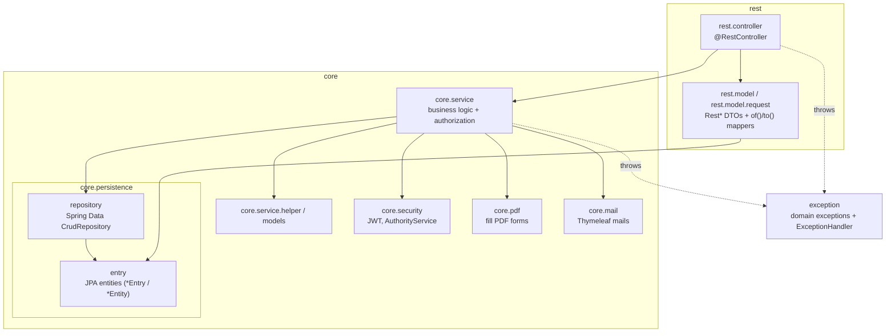
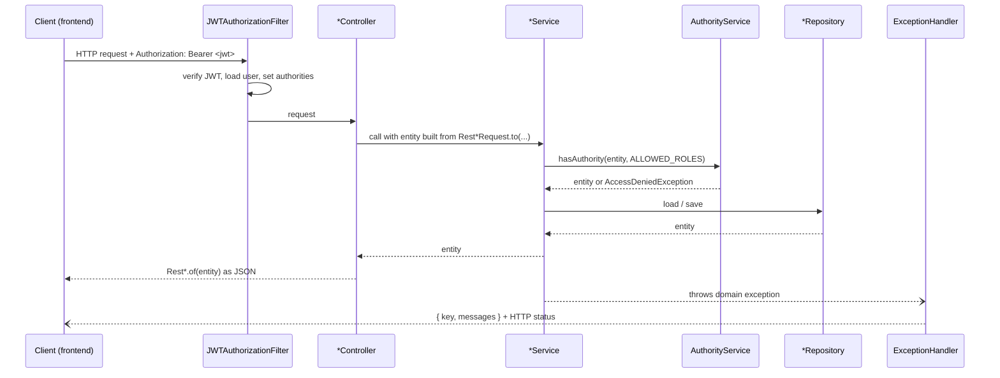
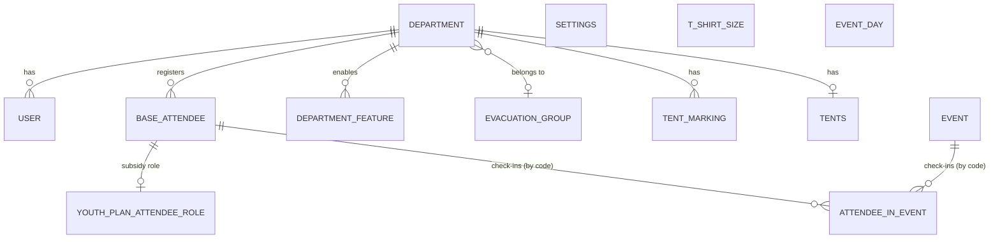

# Backend Architecture

Spring Boot 4 + Kotlin service that manages registrations for a tent camp ("Kreiszeltlager"):
departments (fire brigade youth groups) register their attendees, the organisers configure deadlines,
download generated PDFs/CSVs and check attendees in and out of events via codes/QR codes.

- Base package: `de.kordondev.lagermelder`
- All endpoints are served below the servlet context path `/api`
- Persistence: PostgreSQL 18, schema managed by Liquibase
- Auth: stateless JWT (HMAC512), issued by `POST /api/login`

## Layers

| Package | Responsibility | Rules |
|---|---|---|
| `rest.controller` | HTTP mapping, request validation (`@Valid`), mapping DTO ⇄ entity | Thin. No business logic, **no repository access** – call services. |
| `rest.model` | Response DTOs `Rest*` with `companion object { fun of(entry) }` | Pure data + mapping. |
| `rest.model.request` | Request DTOs `Rest*Request` with `companion object { fun to(request, …) }` | Validation annotations live here. |
| `core.service` | Use cases, validation of business rules, **authorization checks** | Must not depend on `rest` (see known violations below). |
| `core.service.helper` / `models` | Pure, unit-testable logic (e.g. `AttendeeRoleHelper`) and internal result types | No Spring infrastructure where avoidable. |
| `core.security` | Spring Security config, JWT creation/verification, `AuthorityService` | |
| `core.pdf` | Fills the PDF form templates in `resources/data/*.pdf` (PDFBox) | |
| `core.mail` | Sends mails based on `resources/mail/*.html` (Thymeleaf) | Sending is disabled with `application.mail.send=false`. |
| `core.persistence.entry` | JPA entities, enums | No dependency on services, security or rest. |
| `core.persistence.repository` | `CrudRepository` interfaces, JPQL in `@Query` | |
| `exception` | Domain exceptions carrying an error key, global `ExceptionHandler` | |

These rules are enforced by `src/test/kotlin/.../architecture/ArchitectureTest.kt` (Konsist).

### Known violations (frozen, to be fixed)

The architecture test contains allow-lists for the state at the time the rules were introduced.
They may only shrink.

- `core` → `rest`: `JWTAuthorizationFilter`, `CreateJWTAuthentication` (use `RestJWT`, `RestLoginUser`),
  `SecurityService` (`RestOk`), `RegistrationFilesService` (`RestSubsidy`), `YouthPlanAttendeeRoleService`
  (`YouthPlanDistribution`), `EventService` (`RestGlobalEventSummary`), `DepartmentService`
  (`RestDepartmentTentMarkingRequest`). Fix: move these result types to `core.service.models` and map in the controller.
- `rest.controller` → repository: `AuthorizationController` checks uniqueness directly via repositories.
  Fix: move the check into a service.

## Request flow

## Security & authorization

**Authentication**

- `CreateJWTAuthentication` (a `UsernamePasswordAuthenticationFilter`) handles `POST /login` and returns
  `RestJWT`. The token carries the subject (user name), `departmentId` and `role`, and expires after 3 hours.
- `JWTAuthorizationFilter` verifies the bearer token on every request. It loads the user and sets three authorities:
  `USER_ID-<id>`, `DEPARTMENT_ID-<departmentId>`, `ROLE-<role>` (prefixes in `SecurityConstants`).
- `SpringSecurityConfig`: the only unauthenticated endpoints are `/login`, `/actuator/health`,
  `/users/forgotPasswordToken`, `/users/resetPasswordWithToken` and `/public/**`. Everything else requires authentication.
- On startup, `LagermelderApplication` makes sure an admin user exists (`application.admin.passwordHash`).

**Authorization** is *not* done with `@PreAuthorize`. Services call `AuthorityService` explicitly:

| Role (`Roles`) | Meaning |
|---|---|
| `USER` | Department account; may only see/edit data of its own department. |
| `LK_KARLSRUHE` | District office; may see all departments, limited editing. |
| `SPECIALIZED_FIELD_DIRECTOR` | Organiser; manages settings, events and all departments. |
| `ADMIN` | Everything. |

- `hasAuthority(entity, ALLOWED)` passes if the user's department owns the entity **or** the user has one of
  the roles. Otherwise it throws `AccessDeniedException` (→ 403). The `*Filter` variants return a boolean and are
  used to filter lists.
- The role lists are `USER_ALLOWED`, `LK_KARLSRUHE_ALLOWED`, `SPECIALIZED_FIELD_DIRECTOR_ALLOWED` and `ADMIN_ALLOWED`.
- **Every new service method that reads or writes department-owned data must call `AuthorityService`.**

Time-based rules (registration deadlines per attendee type, download start for registration files, check-in
window) live in `SettingsService` (`canBeEdited`, `canRegistrationFilesDownloaded`, …) and throw `WrongTimeException`.

## Domain model

- **Attendees** share the table `base_attendees` (`BaseAttendeeEntry`). Each type adds its own fields via a
  `@SecondaryTable`: `YouthEntry`, `YouthLeaderEntry` (Juleika data), `ChildEntry`, `ChildLeaderEntry`,
  `ZKidEntry` (belongs to another department via `partOfDepartment`) and `HelperEntity` (helper days).
- The type is defined by `AttendeeRole`. All types implement `interfaces.Attendee`. `AttendeeService` routes to
  the matching repository, and the aggregated read model is `core.service.models.Attendees`.
- Every attendee gets a unique `code` (`PasswordGenerator.generateCode()`), which is used for check-in
  (`AttendeeInEventEntry`, `AttendeeStatus` ENTERED/LEFT).
- **Departments** enable feature sets (`DepartmentFeatures`: youth groups, child groups, Z-Kids, helpers) that
  decide which attendee types they may register. A department can be `paused`.
- **Settings** is a single row (id 1) holding event dates, deadlines and organiser data. It is created with
  defaults on first access.
- **Events** (`EventType`: `GlobalEnter`, `GlobalLeave`, `Location`) are soft-deleted (`trashed`).
- **Youth plan** (`AttendeeRoleHelper`, `YouthPlanAttendeeRoleService`): optimises which attendees are reported
  as leader or participant for the state subsidy ("Landesjugendplan").

Entity conventions: Kotlin `data class` with `val`s, an explicit `@Column(name = ...)`, enums stored as `STRING`,
and `equals`/`hashCode` based on the id/code (Hibernate-proxy-safe).

## Error handling

- Domain exceptions in `exception/` carry a `key` from `ErrorConstants`.
- `ExceptionHandler` (`@ControllerAdvice`) maps them to `{ "key": ..., "messages": [...] }` with an HTTP status.
  Examples: `NotFoundException` → 404, `AccessDeniedException` / `ResourceAlreadyExistsException` → 403,
  `BadRequestException` / `UniqueException` / `WrongTimeException` → 400.
- The frontend (`frontend/src/services/errorConstants.ts`) translates the keys. **When you add a key, add it in both places.**
- User-facing messages in exceptions are German.

## Generated files

- `PlanningFilesService`: organiser PDFs (badges, T-shirts, food, contact lists, tent markings, QR codes for
  events) generated with OpenPDF and ZXing, plus a CSV of tents and duties.
- `RegistrationFilesService` + `core.pdf.*`: fill the official form PDFs in `resources/data` (PDFBox AcroForms).
  Downloads are only allowed after `settings.startDownloadRegistrationFiles`.

## Database & migrations

- `resources/db/changelog-main.xml` includes the numbered scripts `db/scripts/NNN_description.xml`.
- **Never edit an existing changeset; always add a new script with the next number.** Hibernate `ddl-auto` is `none`.
- Mock data (`db/mocks/*.csv`) is loaded in the Liquibase context `dev`. Tests run without a context, so the mocks are loaded there too.

## Configuration

| File | Purpose |
|---|---|
| `application.yml` | Defaults (Postgres on `${POSTGRES_HOST:localhost}`, context path `/api`) |
| `application-dev.yml` | Local development (`SPRING_PROFILES_ACTIVE=dev`), mails disabled, CORS for `localhost:9000` |
| `application-prod.yml` | Production |
| `src/test/resources/application.yml` | Tests. The datasource comes from the Testcontainer. |

Local Postgres: `docker compose -f docker-compose/docker-compose-postgres.yml up -d`.

## Testing

| Kind | How | Example |
|---|---|---|
| Unit | Plain JUnit 5 + Mockito/AssertJ, no Spring context | `AuthorityServiceTest`, `AttendeeRoleHelperTest` |
| Integration | `@IntegrationTest` (= `@SpringBootTest` + Postgres 18 Testcontainer), MockMvc via `WebTestHelper`, `@WithMockUser(authorities = [ROLE_PREFIX + …])`, `@Transactional` for rollback | `rest/controller/*ControllerTest` |
| Architecture | Konsist | `architecture/ArchitectureTest` |

Test data builders live in `helper/Entities.kt`. Integration tests need a running Docker daemon.

Things to know when writing integration tests:

- MockMvc built with `webAppContextSetup(context).build()` bypasses the security filter chain. Authorization in the
  services still applies via `@WithMockUser`. To test authentication or department scoping, add
  `.apply(springSecurity())` and use `.with(user(...).authorities(...))` (see `DepartmentAccessTest`, `SecurityConfigTest`).
- `@Transactional` tests run all requests in one transaction, while production uses one per request. Call
  `webTestHelper.flushAndClear()` between creating and reading attendees, because all attendee types share `base_attendees`.
- Use `webTestHelper.createDepartment(mockMvc, features)` to create departments. Attendees are only visible if the
  department has the matching feature (e.g. `YOUTH_GROUPS`).
- Birthdays are ISO dates (`yyyy-MM-dd`).
- Settings are created lazily on first read, and only a specialized field director may do that.

## Known technical debt

- The JWT signing secret is hard-coded in `SecurityConstants.SECRET`. It should come from configuration/an environment variable.
- `PlanningFilesService` is very large (800+ lines) and has no tests.
- Some services return `rest.model` types (see known violations).
- detekt findings are frozen in `config/detekt/baseline.xml`.
- `POST /departments` with features fails, because the features are saved with `department_id = 0`.
  `POST /register` (used by the frontend) works around it by saving the features in a second step.
- `SettingsService.getSettings()` creates the default settings through `saveSettings()`, which requires the specialized
  field director role. If the first read on an empty database comes from another role, it fails with 403.
- The frontend `errorConstants.ts` lacks `CHANGED_ROLE`, `WRONG_TYPE` and `MAIL_NOT_SEND_ERROR`, so those messages are not shown.
- An unknown `group` parameter for registration files raises `IllegalArgumentException`, which results in a 500.
- `getAttendeesForDepartment` filters child leaders without the feature check that the other attendee types have.
- Errors sent with `sendError` (e.g. 401 for a wrong password at `/login`) are forwarded to `/error`, which is not
  `permitAll`. The client therefore gets 403 without a body instead of 401. `/error` should be permitted in `SpringSecurityConfig`.
- `application.yml` also sets `spring.jpa.properties.jakarta.persistence.jdbc.url` with a fixed port 5432. Hibernate uses it,
  so overriding only `spring.datasource.url` (e.g. a second local instance) migrates one database and reads another.
- Jackson 3 changed defaults that the frontend relies on (enums via `toString()`, missing primitives). They are restored in
  `rest/JacksonConfiguration.kt`; `JsonContractTest` guards the contract.
